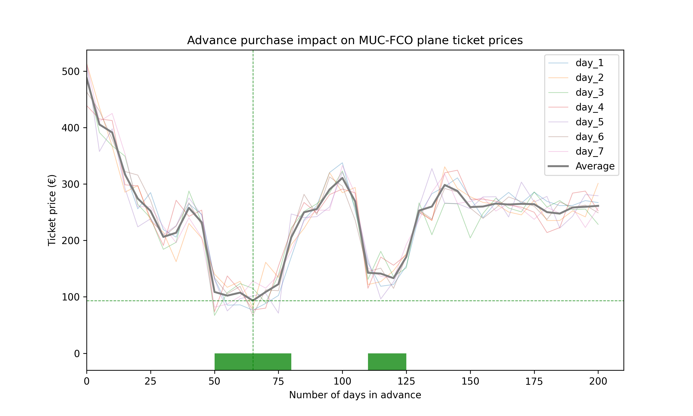

# Flight Analysis

## Overview 🛫
Welcome to my latest project "Flight Analysis"!
<br>

It's a handy Python project I created to extract flight price data from Google Flights, to then perform some regression/supervised learning techniques to extract precious and - more importantly - actionable insights.
<br>

The main features are:
- Scraper for Google Flight results
- Data cleaner and formatter to dataframe<br>

Currently developing (also see [future implementations](#future-implementations-📈)):

- Data collection and storage (database)
- Automation of script run
- ML technique for forecasting/clustering/predicting

## Motivation 💡
I've always loved traveling and exploring, especially in new countries with completely different cultures. I also really like data and its powerful usage.
<br>

That is why I came up with the idea of combining two of my passions into this one personal project, with the aim of showcasing my data-related skills, but also save a great part of my travel budget that I would otherwise spend buying suboptimal plane tickets.


## Usage ⚙️
The goal of the script is to be as easy as possible to use.
The whole project is written has been created with Python 3.11 and is based on the following libraries only:
- pandas
- numpy
- matplotlib
- selenium
- tqdm
- pytest

A very simple example of the main scraping functionality could be the following (get all flight from Munich (MUC) to Los Angeles (LAX) on May 28th, 2023):
```
from google_flight_analysis.scrape import *

flights = Scrape("MUC", "LAX", "2023-05-28")
flights.data
```

The following lines would produce this output:

|    | Departure datetime   | Arrival datetime    | Airline(s)                                 | Travel Time   | Origin   | Destination   |   Num Stops | Layover   | Stops Location   |   Price (€) | Price Trend   |   Price Value | Access Date         | Flight Type   |   Days in Advance |
|---:|:---------------------|:--------------------|:-------------------------------------------|:--------------|:---------|:--------------|------------:|:----------|:-----------------|------------:|:--------------|--------------:|:--------------------|:--------------|------------------:|
|  0 | 2023-05-28 08:00  | 2023-05-28 15:00 | Lufthansa, Condor                          | 16:00         | MUC      | LAX           |           1 | 02:25     | FRA              |         705 | high          |           180 | 2023-05-23  | One Way       |                 4 |
|  1 | 2023-05-28 11:00  | 2023-05-28 20:05 | Lufthansa, LOT                             | 18:05         | MUC      | LAX           |           1 | 04:15     | WAW              |         773 | high          |           180 | 2023-05-23  | One Way       |                 4 |
|  2 | 2023-05-28 07:30  | 2023-05-28 16:00 | Iberia, American, Finnair                  | 17:30         | MUC      | LAX           |           1 | 02:20     | MAD              |         804 | high          |           180 | 2023-05-23  | One Way       |                 4 |
|  3 | 2023-05-28 14:00  | 2023-05-29 08:41 | Lufthansa, Norse Atlantic Airways, JetBlue | 27:41         | MUC      | LAX           |           2 | BER, JFK  | BER, JFK         |         696 | high          |           180 | 2023-05-23  | One Way       |                 4 |
|  4 | 2023-05-28 09:55  | 2023-05-28 20:05 | LOT                                        | 19:10         | MUC      | LAX           |           1 | 05:15     | WAW              |         789 | high          |           180 | 2023-05-23  | One Way       |                 4 |
|  5 | 2023-05-28 07:15  | 2023-05-28 13:10 | Air France, Delta                          | 14:55         | MUC      | LAX           |           1 | 01:40     | CDG              |         987 | high          |           180 | 2023-05-23  | One Way       |                 4 |

## Case studies
### #1: Exploring Mexico 🇲🇽
In March 2023 I planned to go to Mexico and Belize. I had 4 weeks at my disposal, and I was planning a trip of 3 weeks in total, therefore I had some room to play with for when to leave and when to return.
<br>

My main goal was to minimize the overall plane ticket costs, even though it mean doing an extra layover or traveling for more hours (I didn't mind the adventurous journey :)).
<br>

Thanks to an initial version of the script, I was able to collect data about multiple combinations of flight solutions, namely:
- Departure airport: Munich, Nuremberg, Frankfurt, Vienna
- Arrival airport: Mexico City, Cancún, Oaxaca
- Date of departure: any 3-week period (+- 2 days) in April

Hypothetically, I would have to check 4 departure airports * 3 arrival airports * 50 different periods satisfying the "3 weeks (+- 2 days) in April condition", which means a total of 600 Google Flight searches.

<br>
<u>With the help of the script, I was able to scrape all the data automatically in less than an hour, creating an organized dataset of all flight, which allowed me to pick the best combination.</u>

<br>
<i>I ended up flying from Frankfurt to Toronto, and then Toronto to Mexico City. This saved me around 360€ compared to my initial Munich-Mexico City flight on the 2 fixed dates that I thought would be the best (and allowed me to see a new city, even if only for a few hours 😉)</i>
<br><br>

### #2: Back home 🇮🇹
Being originally from Rome, and having lived there until I was 19, I still have strong connections with friends and family there.
<br>

It is often the case that I know in advance when to fly back home (i.e. for Christmas, semester break etc...), but I never know when to buy my tickets.
<br>

<u>Thanks to the script, I was able to identify the optimal time range for when to buy my tickets in advance, up to the most optimal number of days in advance.</u>
<br>

Here is a graphical visualization of the price trend, computed over 7 days of flight scraping:


<br>

<u>I now know that if I want to minimize the price I pay for my Christmas tickets, I should purchase them between 50 and 78 days in advance, ideally exactly 65 days before the departure.</u>
<br>

## Future Implementations 📈
- [ ] Visualizations of results (flight prices over time, trend, average...)
- [ ] Flight prices forecasting
- [ ] Automatization of script run (to collect data on a periodic base)
- [ ] Creation of alerts and reports
- [ ] Also include CO2 emission values
- [ ] Feature engineering for ML tasks
